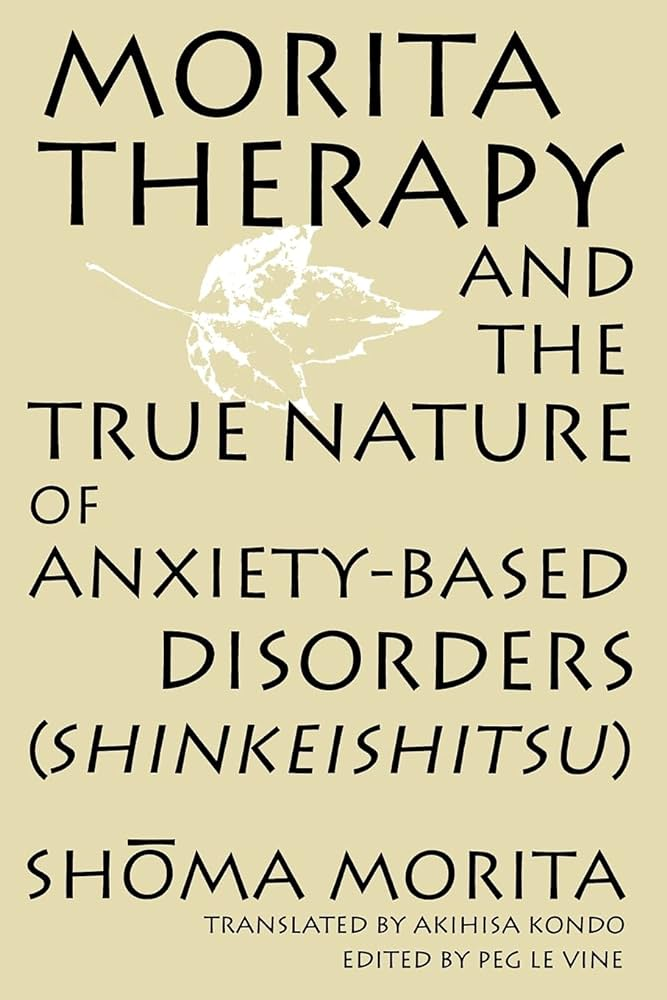

Morita Therapy is a form of psychotherapy that originated in Japan in the 1920s. It was developed by Dr. Shoma Morita, who believed that excessive psychological attachment and rumination over one's emotions was a primary cause of many mental health issues. 

The core principle of Morita Therapy is to encourage patients to take constructive action and re-engage with life, rather than dwelling excessively on distressing thoughts and feelings. Patients are guided to accept their emotions without judgement, while simultaneously pursuing purposeful activities aligned with their values and goals. 

A key technique is "purposeful temporary inactivity" where patients intentionally rest without distracting themselves, practicing acceptance of uncomfortable thoughts and sensations that arise. This builds psychological flexibility and tolerance for discomfort. Patients then gradually re-engage in meaningful activities, even if accompanied by unpleasant emotions initially.

Unlike some Western therapies which focus heavily on analyzing the root causes of distress, Morita places more emphasis on changing unhelpful behavior patterns in the present moment. It aims to cultivate an attitude of calm non-resistance towards unpleasant inner experiences.

While not as widely practiced as CBT or psychoanalysis, Morita Therapy has been found effective for various conditions including anxiety, depression, and psychosomatic disorders. Its philosophy meshes well with concepts from mindfulness and acceptance-based therapies that have gained traction in recent decades.

See also [project-7](../projects/project-7.md)