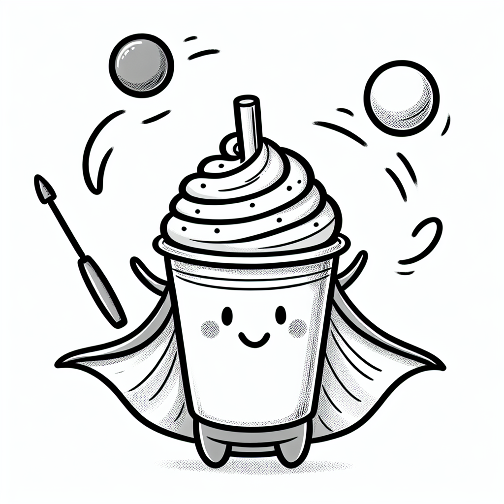

Rea,

Did you know that sometimes we do things for reasons we don't even realize? It's like having a secret purpose we don't even know about. Let me tell you a story about milkshakes that might help you see this.

Once upon a time, McDonald's was curious why people bought their milkshakes in the morning. It's not really breakfast food, right? So they teamed up with this Harvard professor named Clayton Christiansen to figure out why. Clayton and his team hid out in a McDonald's parking lot, waiting for people to buy a milkshake at the drive-thru. Then they'd jump out and stop them and ask them why they did. That must have been a scene!

Anyways, Clayton originally thought people were buying them because they were hungry or thirsty. But here is what they really found. A lot of those people were buying the milkshake to make their morning commute less boring. The milkshake was actually entertainment. It was easy to drink while they were driving. Eating a big mac while driving is much harder!

This discovery got Clayton thinking about how things often have "secret jobs" beyond their obvious purpose. Just like how a milkshake's hidden role was to be a fun commute companion, your Winnie the Pooh bear might have secret jobs too. Sure, he's a cute and cuddly toy, but his real job might be to help you feel safe when it's dark or to be a patient listener when you need to talk. Both the milkshake and Winnie are doing more than what they were originally designed for!

Here's something to ponder today: _Why do you really do your homework?_ Is it purely for learning, or are there other covert reasons? Maybe it's to feel a sense of accomplishment, or to compete with your classmates, or to satisfy your curiosity about the world. There's no right or wrong answer - it's just an interesting thought experiment.

You're now equipped with a new lens to view the world. See if you can spot any other "secret jobs" things might be doing. Who knows what you'll discover!

Love,

Abba
July 11, 2024
