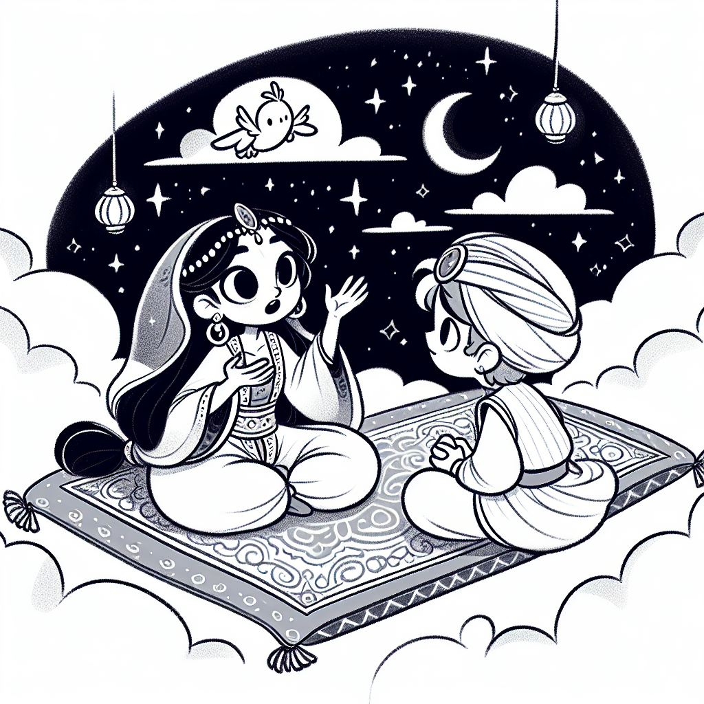

Rea,

You had a bit of trouble going to sleep last night! The magical world of Harry Potter cast its spell on you, didn't it?  Your reading marathon reminded me of a famous collection of stories called "The 1001 Nights" or "Arabian Nights." Let me tell you about it!

Once upon a time, there was a grumpy king named Shahryar who would marry a new wife every day and then… execute them!. (Yikes!) But then came Scheherazade, a clever and brave young woman. She had a plan. On her first night as the king's wife, she began telling him a story. But just when the story got really exciting, she stopped!

"Oh no!" said the king. "What happens next?"

Scheherazade smiled and said, "I'll tell you tomorrow night, if you let me live."

The king, totally hooked, agreed. Night after night, Scheherazade told exciting stories of genies, magic lamps, flying carpets, and hidden treasures. She always stopped at the most thrilling part, keeping the king eager for more.

This went on for 1001 nights! By the end, the king had fallen in love with Scheherazade and her amazing stories, becoming a much kinder ruler.

You see, Rea, Scheherazade knew the secret that kept you up reading Harry Potter - the power of a good cliffhanger! It's like a little hook that catches our imagination and won't let go.

Next time you're reading, see if you can spot the cliffhangers. Where does the chapter end? Does it make you want to keep reading? Maybe you could even try writing a story with your own cliffhanger! Just remember - unlike King Shahryar, you still need to get some sleep, even when the story is super exciting!

Sweet dreams and happy reading, 

Abba  
July 16, 2024