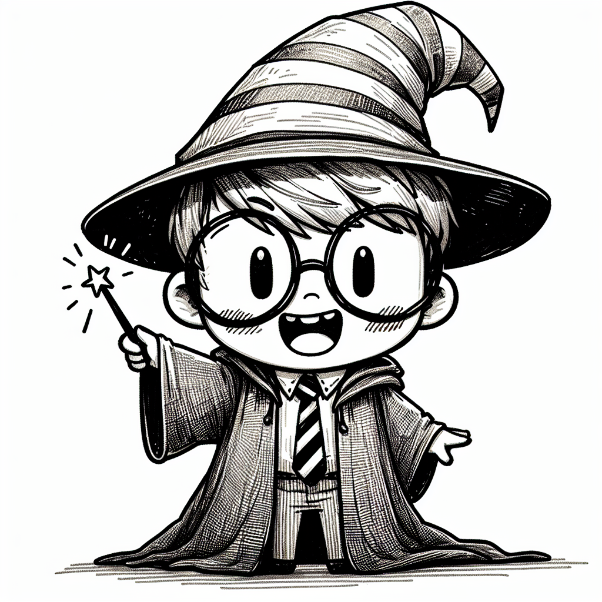

Dear Rea,

It's incredible to see you step into the magical world of Harry Potter. A good book has the power to suck you in, doesn't it? Time flies by when you're lost in those pages. While you're enjoying the adventures of Harry, Ron, and Hermione, I thought it would be fun to tell you the story of the book's author, J.K. Rowling. Her story inspires me for her dedication and persistence.

Once upon a time, there was a young girl named Joanne Kathleen Rowling. She was born in a small town in England and grew up with a vivid imagination and a love for storytelling. As she grew older, Joanne dreamed of becoming a writer, but life had other plans for her.

After finishing university, Joanne found herself struggling. She was a single mother, living on welfare, and battling depression. But even in her darkest moments, she clung to a magical idea that had come to her on a delayed train journey – a story about a young wizard named Harry Potter.

With her baby daughter sleeping beside her, Joanne would sit in cafés, sipping coffee she could barely afford, and pour her heart into her story. She created a world of witches and wizards, of friendship and bravery, of good versus evil.

When her manuscript was finally complete, Joanne sent it out into the world, hoping someone would see the magic she saw. But the world can be a harsh place for dreamers. One by one, publishers turned her away. "No one wants to read about boy wizards," they said. But Joanne refused to give up.

Twelve times her story was rejected, but Joanne kept believing. She knew in her heart that somewhere out there, someone would love Harry as much as she did.

And then, like magic, it happened. A small publishing house called Bloomsbury saw the spark in Joanne's story. They decided to take a chance on the boy wizard and his creator.

The rest, as they say, is history. Joanne, now known to the world as J.K. Rowling, watched as her little story about a boy wizard grew into a global phenomenon. Her perseverance had paid off, and she had transformed from a struggling single mother into one of the world's most beloved authors.

So, Rea, whether you're reading, writing, or chasing any dream, remember J.K. Rowling's story. Persistence can make magic happen in real life too. Who knows? Maybe one day, you'll create something that will inspire the world, just like Harry Potter did.

Love,
Abba
