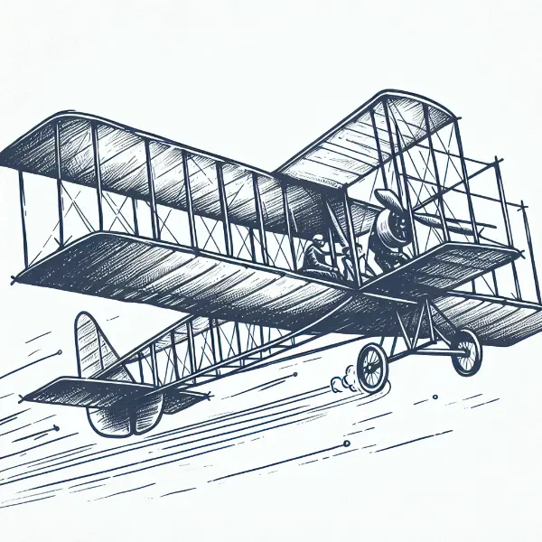

Dear Rea,

Can you believe it? Today we're about to board a plane in Austin and travel 4,192 miles to London! That's a long distance, especially when you consider that the very first powered flight was only 120 feet - about the length of 4 school buses lined up end to end. It's even less than the length of our entire property, from the front sidewalk to the back fence!

You might think that inventing something as amazing as an airplane would require a huge company with lots of money. But the story of flight began with just two brothers, and I'd like to share their story with you.

Once upon a time, in Dayton, Ohio, there lived two brothers named Wilbur and Orville Wright. They weren't rich or famous, and they didn't have fancy college degrees. In fact, they ran a simple bicycle shop. But these brothers had a burning passion for solving problems and a deep curiosity about flight.

In their spare time, Wilbur and Orville read everything they could about flying. They watched birds soar through the sky, wondering how they could imitate them. The brothers built kites and tested different wing shapes. They worked on experimenting and learning from each failure.

Their bicycle shop became their laboratory. They used their knowledge of balance and mechanics from bicycles to help them understand flight. Little by little, through determination and clever thinking, they solved one problem after another.

And then, on a cold December morning in 1903, on a windy beach in North Carolina, their dream took flight. For 12 seconds, their invention - the first powered airplane - soared through the air. It wasn't much, but it changed the world forever.

The Wright brothers' story shows us that if you find something you truly enjoy and dedicate yourself to learning and improving, amazing things are possible. You don't need to be the smartest or the richest; you just need passion and perseverance.

Rea, I know you love learning about the stories behind things - just like I do! That's one of the reasons I enjoy writing these letters to you so much.

Love,
Abba
July 19, 2024
