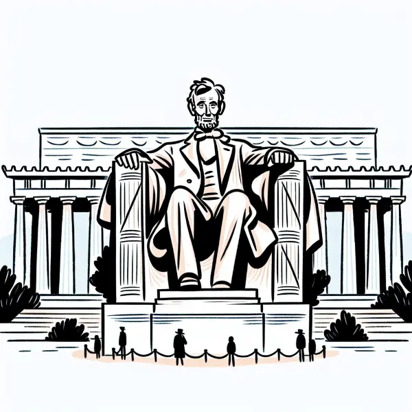

Dear Rea,

As you enter upper school (5th grade), the level of problem-solving expected of you will get more complex. To help you prepare, I want to tell you a story about problem-solving that involves one of America's most famous monuments - the Lincoln Memorial.

The National Park Service, which takes care of many important landmarks in our country, had a big mystery on their hands. The Lincoln Memorial was getting dirty very quickly, and worse, its beautiful white stone was starting to crack! They needed to figure out why this was happening and how to stop it.

To solve this puzzle, they used a technique called the "5 Whys." This is a simple but powerful rule: when you have a problem, try asking "why" five times to get to the root cause. Let me show you how they did it:

1. Why was the monument getting dirty so fast? Because birds were making a mess on it.

2. Why were there so many birds? Because they were eating lots of spiders.

3. Why were there so many spiders? Because they were eating tiny flies called midges.

4. Why were there so many midges? Because they were attracted to the bright lights on the monument.

5. Why were the lights attracting midges? Because they were turned on at dusk when midges are most active.

Can you believe it? By asking "why" five times, they discovered that the time the lights came on was causing all these problems!

The National Park Service's clever solution was to simply delay turning on the lights by one hour. This small change meant fewer midges, which led to fewer spiders, fewer birds, and a much cleaner monument. It also meant they didn't have to clean the monument as often, which helped prevent damage to the stone.

This story teaches us something important: when we face a complex problem, the solution isn't always obvious at first. We need to keep asking questions and digging deeper to find the real cause.

Love,
Abba
