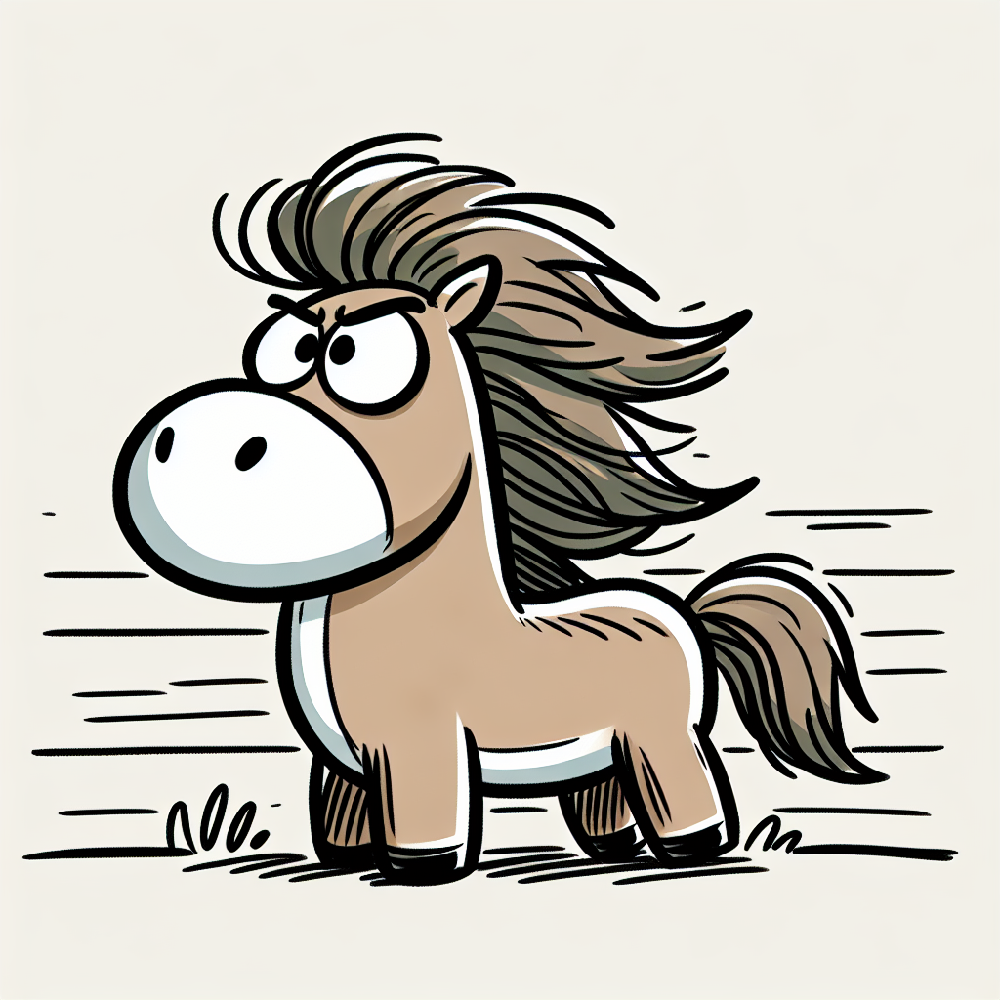

Rea,

You know how you ask me for stories in my letters? Well, that got me thinking about something really interesting! Did you know that many of the world's traditions use stories to share wisdom? 

In Christianity, these special stories are called *parables*. Islam has something called "*hadiths*." Zen Buddhism has interesting teaching stories called "*koans*." 

Today, I want to share one famous koan with you. It's about a farmer and his horse. 

Once upon a time, there was a farmer who had a horse he loved very much. One day, the horse ran away. The farmer's neighbors said, "Oh no! Your horse ran away. That's terrible luck!" But the farmer just said, "Maybe so, maybe not. We'll see."

A few days later, guess what? The horse came back! And it brought some wild horse friends with it. The neighbors got excited and said, "Wow! Your horse brought back more horses. That's amazing luck!" But the farmer just said, "Maybe so, maybe not. We'll see."

Then, the farmer's son tried to ride one of the new wild horses. Oops! He fell off and broke his leg. The neighbors said, "Oh dear! Your son broke his leg. That's awful luck!" But the farmer just said... can you guess? That's right! "Maybe so, maybe not. We'll see."

A little while later, soldiers came to town to take all the young men to join the army. But they couldn't take the farmer's son because of his broken leg. The neighbors said, "Your son doesn't have to go to war. That's incredible luck!" And the farmer said... you know it... "Maybe so, maybe not. We'll see."

Now, here's a question for you: What do you think this story is trying to teach us?

I think it's showing us that what we think is good or bad can change as time goes on. Sometimes, things that seem bad at first might lead to something good, and things that seem good might lead to something not so great.

Here's a fun challenge for you: Can you try to notice things today that might seem good or bad at first, but could change later? Maybe we can talk about what you observed at dinner!

Love,
Abba
