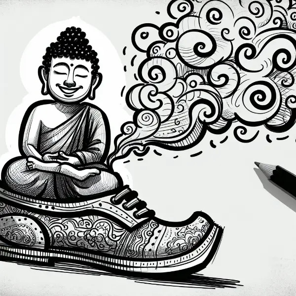

Dear Rea,

I know that every Friday during your school's community meeting, you practice meditation. Today, I'd like to share a story with you that I first heard when I was learning about meditation.

Once upon a time, in ancient India, there lived a king who was rich and powerful beyond imagination. He had gilded palaces, amazing gardens, incredible chariots, and the finest horses. Any comfort he desired, he could have at a moment's notice.

One day, as he walked out of his palace, he stepped on a thorn. Furious, he immediately called his assistant and demanded, "This is outrageous! I want you to cover the entire palace grounds with leather so that wherever I walk, I won't be bothered by thorns, rocks, or anything else!"

The assistant listened patiently to the king's command. After a while, he returned with a solution. "Your Majesty," he said, "covering the palace grounds with leather may not be practical, but I have a better solution." He presented the king with a pair of shoes. "We can cover your feet with leather instead. Now, wherever you walk, you won't be bothered by thorns and rocks."

So, what does this have to do with meditation, you might wonder? Well, the world around us can be full of challenges - thorns and rocks, if you will. Practicing meditation is like creating shoes for our minds. It doesn't make the challenges disappear, but it helps us navigate them more easily.

Remember, though, that just like shoes don't make thorns vanish from the ground, meditation doesn't make life's problems disappear. They're still there, and sometimes they might even get through our mental "shoes." But with practice, we develop more capacity to handle these challenges calmly and thoughtfully.

As you continue your meditation practice, I'd like you to think about a few things:

1. Can you recall a time when you felt like the king, wanting to change the whole world around you instead of changing your approach?
2. What other "mental shoes" do you think people can develop to help them navigate life's difficulties?

Maybe we can even try meditating together sometime!

Love,
Abba
