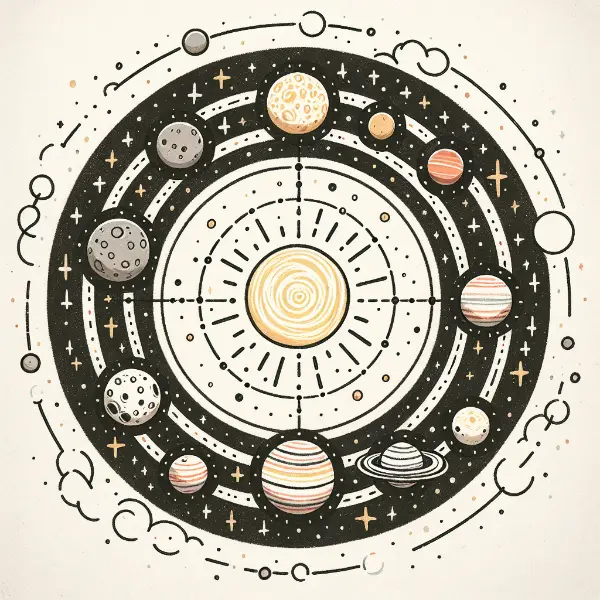

Dear Rea,

Happy Monday! As you begin your second full week of school, I found myself wondering about the origins of the days of the week and why we have a 7-day week. It's quite a celestial story!

The ancient Babylonians, who lived in what is now Iraq around 2300 BCE, are credited with creating the seven-day week. These skilled astronomers noticed seven celestial bodies in the sky: the Sun, the Moon, and five planets visible without telescopes. They divided their lunar month into four parts, giving us the seven-day week.

Now, let's explore how each day is connected to these heavenly bodies:

**Monday** - Moon day! This one's easy to remember.

**Tuesday** - Originally named after Mars, the red planet. In Old English, it became "Tiwesdæg" after Tiw, their god of war, who they associated with Mars.

**Wednesday** - Named after Mercury. It became "Wodnesdæg" in Old English, after Woden, their chief god, whom they linked with Mercury.

**Thursday** - Jupiter's day! In Old English, it became "Thursdæg" after Thor, the thunder god, as they saw similarities between Jupiter and Thor.

**Friday** - Venus day. It turned into "Frigedæg" in Old English, named after Frigg, the goddess of love, who they connected with Venus.

**Saturday** - Still Saturn's day, one of the few that kept its planetary name!

**Sunday** - The Sun's day, of course!

Isn't it interesting how our week is a map of the solar system as ancient people saw it? The planets march across our calendar just as they move across the night sky.

Love,
Abba
