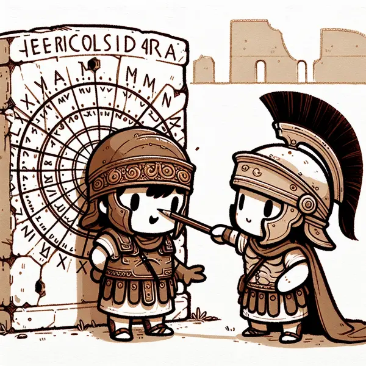

Dear Rea,

I hope this letter finds you well! Yesterday, I shared the story of our weekdays, and today I'd like to take you on a journey through the months of the year.

Did you know that our current Gregorian calendar, named after Pope Gregory XIII who introduced it in 1582, has its roots in the Roman calendar from 753 BC? It's quite a tale!

The original Roman calendar had 12 months like ours, but only 10 had names. Surprisingly, January and February didn't exist - they were just considered a 'dead' winter period. March kicked off the year, named after Mars, the god of war, as that's when military campaigns resumed.

Some months were named after deities - May for Maia and June for Juno. April comes from the Latin word "aperio," meaning "to open," referring to spring when flowers bloom. The rest were simply numbered: Quintilis (fifth), Sextilis (sixth), September (seventh), October (eighth), and so on.

Later, January and February were added, completing our 12-month year. But this created an interesting situation - the numbered months were now out of sequence! September, meaning "seventh," became the ninth month, and the others followed suit.

Quintilis and Sextilis got fancy new names. Quintilis became July, honoring Roman emperor Julius Caesar, and Sextilis turned into August for Emperor Augustus. Just imagine - without these changes, we'd be celebrating Ammi's birthday on the 7th of Quintilis!

Isn't it interesting how our calendar has evolved? We haven't even discussed leap years yet - that extra day we add to February every four years to keep our calendar aligned with Earth's orbit.

What do you think about all this, Rea? If you could rename a month, what would you call it?

Love,
Abba

P.S. Next time someone asks you the date, you can impress them with your calendar history knowledge!
