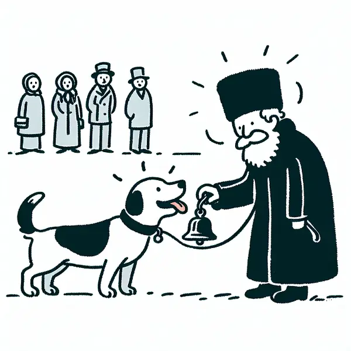

Dear Rea,

Do you think you feel hungry because your body needs food? Or do you get hungry because the bell for lunchtime rings? It's an interesting question, isn't it? Today, I'd like to tell you about a Russian scientist named Ivan Pavlov who discovered something fascinating by accident.

In the late 19th century, Pavlov was studying digestion in dogs. He would give them food and measure how much they salivated. But he noticed something odd: the dogs started salivating before they even saw or smelled the food. They would drool at the sound of the lab assistants' footsteps or the sight of their white lab coats.

Intrigued, Pavlov decided to investigate further. He set up an experiment where he would ring a bell before feeding the dogs. After doing this several times, he found that the dogs would start salivating at the sound of the bell alone, even when no food was present.

This was a groundbreaking discovery! Pavlov had stumbled upon what we now call "classical conditioning." He showed that a neutral stimulus (like a bell) could be associated with a natural response (like salivating for food) if they were paired often enough.

Pavlov's work kicked off the entire field of behavioral psychology. Scientists began to realize that many of our behaviors and reactions might be learned responses, just like the dogs salivating at the bell.

This automatic behavior is more prevalent in our lives than we might realize. By some estimates, about half of what we do is driven by habits - automatic responses to cues in our environment. Just like Pavlov's dogs learned to associate the bell with food, we often associate certain sights, sounds, or situations with specific behaviors or emotions.

For example, you might feel hungry when you smell popcorn at the movie theater, even if you've just eaten. Or you might feel sleepy as soon as you lie down in bed, even if you weren't tired before. These are all examples of conditioned responses.

Understanding this can be powerful. It means we can shape our habits by being mindful of the cues around us and the responses we're reinforcing. So next time you feel hungry, ask yourself: is it your body that needs food, or is it just the lunch bell ringing?

Love,
Abba
