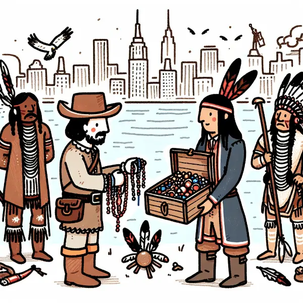

Rea,

You've been learning about how some explorers used force to take over lands, enslave people, and convert them to Christianity. But not all explorers came with these intentions. Some were traders, seeking to make business deals with the native peoples. They weren't after gold or religious conversion, but rather mutual exchange. Today, I want to tell you about one such business deal and how it turned out – a story that raises interesting questions about what it means to "own" something.

Back in the early 17th century, the Lenape tribe lived in what we now call New York. They called Manhattan Island "Manhatta," meaning "hilly island." In 1626, a small Dutch boat arrived on these shores. Peter Minuit, director of the Dutch West India Company, stepped onto the land with an offer that would become legendary.

Minuit met with the Lenape and proposed a trade: the entire island of Manhattan for 60 guilders worth of goods – beads, trinkets, and such. In today's money, that's roughly equivalent to $24. It sounds like an incredible bargain, doesn't it?

But here's where it gets interesting. The concept of land ownership was foreign to the Lenape. They didn't share the European idea of property rights. For them, land, like water and air, couldn't be owned or sold. They moved to different places during winter and summer, sharing the land with nature and other tribes.

Some stories suggest that the Lenape thought the Dutch were simply giving them gifts to share the land, not to buy it outright. They might have believed they were entering into a mutual agreement to coexist, not selling their home.

This story makes us think about ownership, Rea. What does it really mean to own something? Can we truly own the air around our house when the wind constantly blows it away? Can we own a river when its water is always flowing and changing? The Lenape saw land much like we see air or flowing water – as something to be used and respected, but not owned.

How might our world be different if we thought about land ownership the way the Lenape did? Can you imagine a world where land, like air, belongs to everyone and no one at the same time? How would that change the way we live?

Remember, history is complex, and there's often more to a story than what we first hear. Keep questioning, keep exploring, and always try to see things from different perspectives.

Love,
Abba
