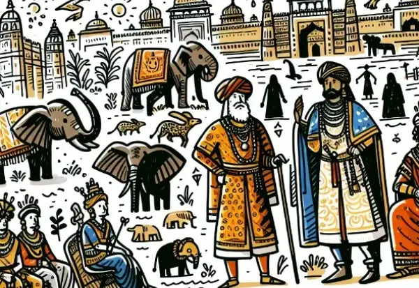

Dear Rea,

You've been learning about colonial powers trying to find a way to India. But have you wondered why they were so eager to go there in the first place? Today, I want to imagine what an average person in Europe during the 1400s might have thought about India.

Picture this: India was seen as a hot, far-off place with strange weather. The animals there were considered exotic and unbelievable. Remember, people in Europe back then had no zoos or pictures to look at. Can you imagine hearing a description of an elephant for the first time? It must have seemed like a creature from a fairy tale!

India was also believed to be a land overflowing with wealth. Europeans dreamed of fine silks, precious jewels, and exotic spices. These luxuries were rare and valuable in Europe, making India seem like a treasure trove.

The people of India were described as looking very different from Europeans. Without photographs or accurate drawings, imagine how wild people's imaginations could run! Everything they knew came from stories passed down by word of mouth.

Most of what Europeans "knew" about India came from old tales of Alexander the Great's adventures and Marco Polo's travels. But over time, these stories probably got mixed up with myths and exaggerations, making India seem even more mysterious and magical.

Now, imagine you're living in this world, and a young Christopher Columbus is recruiting crew members for a voyage to India. Would you go? It would be a leap into the unknown, full of danger but also the promise of adventure and riches.

We're lucky today. Before we travel, we can watch videos and see pictures of our destination. But back then, people had to rely on vague descriptions and their imagination. How different do you think it would be to embark on such a journey with only the information available in the 1400s?

Think about it: Would you have been brave enough to sail off into the unknown? What do you think would have excited you most about the idea of India? And what might have scared you?

Remember, Rea, our view of the world is shaped by the information we have. It's fascinating to think about how differently people saw the world in the past, and how that influenced their actions.

Love,
Abba
