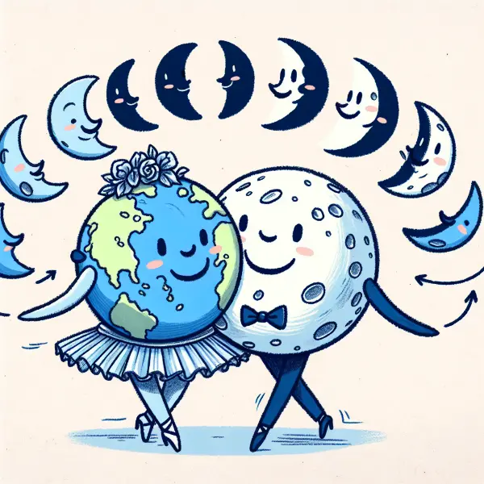

Rea,

You know that a year is 365 and a quarter days long, right? We account for that quarter day by adding a leap day every four years. But did you know that a long, long time ago, a year on Earth was over 400 days long?

First, let's clarify what a year and a day mean. A year is how long it takes for Earth to go around the Sun once. This hasn't changed. A day, on the other hand, is how long it takes for Earth to rotate once on its axis, giving us one full cycle of daylight and darkness. This is what has changed over time. So, if a year was over 400 days long in the past, it means that Earth used to spin faster, making each day shorter.

Now, you might wonder how scientists figured this out. They studied certain rock formations and fossils that show the effects of tidal patterns. We have two high tides and two low tides each day. Well, these tides leave marks in some rocks and fossils. By counting these marks, scientists could tell how many days were in a year long ago!

But what caused Earth to slow down? The answer is our Moon! As Earth rotates, it's constantly pulling the Moon along in its orbit. This transfer of energy from Earth to the Moon causes Earth's rotation to gradually slow down. It's like when you're spinning on a merry-go-round and you stick your arm out – you slow down a bit.

This change happens very, very slowly. In fact, Earth's rotation is still slowing down today, but only by about 1.8 milliseconds per century. That's so small we don't notice it in our daily lives.

But there's more to this story! As Earth's rotation slows down, the Moon is actually moving farther away from us. It's drifting away at about 1.5 inches (3.8 cm) per year. This means that in the past, the Moon was much closer to Earth than it is now.

Imagine looking up at the night sky millions of years ago. The Moon would have appeared much larger! This closer Moon also had stronger effects on Earth, causing even bigger tides and possibly influencing our planet's climate and the evolution of life.

Here's a question for you: If something as fundamental as the length of a day can change over time, what other things in our world might be changing so slowly that we don't notice? How might Earth be different in a million years?

Our world is always changing, even if we can't always see it happening.

Love,
Abba
