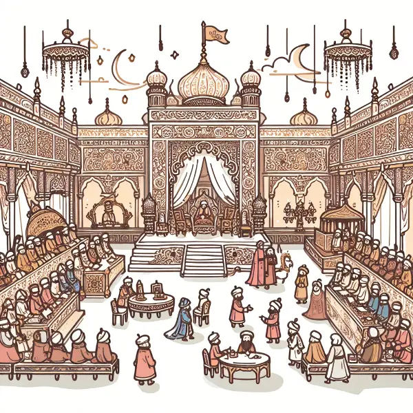

Rea,

I hope you're enjoying learning about Marco Polo's incredible journeys. Today, I want to share how we almost never knew his story, and it might make you think about history in a whole new way.

Did you know that the famous tale of Marco Polo's travels almost never reached us? It's a bit like finding a message in a bottle washed up on a beach - a chance encounter that changed history.

Marco Polo left Venice in 1271 with his father Niccolò and uncle Maffeo, traveling along the Silk Road to China, which was then part of the vast Mongol Empire. When they finally returned to Venice in 1295, after an astonishing 24 years away, people barely recognized them in their Mongolian clothes! They had been gone so long that everyone thought they were dead. But when they revealed gems hidden in their garments, suddenly everyone was very interested in their story.

Now, here's where it gets interesting. In 1298, Venice went to war with Genoa, and Marco Polo ended up in a Genoese prison. This could have been the end of his story, but as luck would have it, one of his cellmates was a writer named Rusticello from Pisa.

As Marco entertained everyone with his tales of China, including his time serving in the court of Kublai Khan, Rusticello wrote them down. Their collaboration resulted in "Livre des Merveilles du Monde" (Book of the Marvels of the World), initially written in Old French. This book didn't just describe China, but also places like Persia, Armenia, and India. If these two hadn't met in that prison, we might never have known about Marco Polo's adventures!

This makes me wonder: How many other amazing stories from history have we missed? Were there other European travelers with incredible tales that were never shared? It's like thinking about messages in bottles floating in the ocean, full of stories we'll never read.

Here's something to ponder, Rea: History is full of chance encounters and near misses. The stories we know are just a tiny fraction of what actually happened. How many unsung heroes and untold adventures might be hidden in the past?

Remember, some historians are skeptical about parts of Marco Polo's account. This reminds us to always think critically about historical sources, even famous ones.

Love,
Abba
