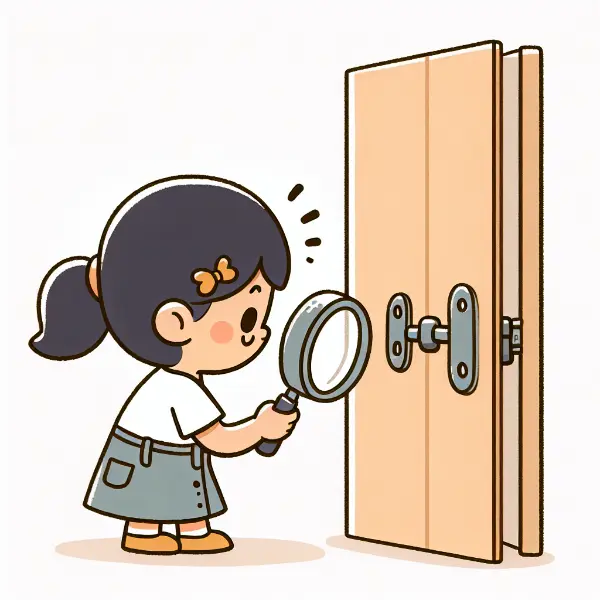

Rea,

Today I have a challenge for you. Can you think about the number of doors you walked through yesterday? Chances are you don't know the number but can remember where you might have gone through a door - at home, at school, at the university? Now how many of those doors opened inward vs outward?

Why do you think they work the way they do? One thing that governs how doors are installed has to do with the building code. A building code is a set of rules that tells people how buildings should be constructed to keep everyone safe.

According to the code, any room that can hold 50 or more people must have doors that swing outward in the direction of the exit route. This is crucial for safety. Imagine if there's a fire and everyone is rushing to get out. If the door opened inward, people might crowd against it, making it impossible to open. An outward-opening door can always be pushed open, even if there's a crowd.

We don't typically have more than 50 people in a house, so we don't have that requirement. Plus, when you put a door to open outside, the hinges that hang the door to the wall are outside, which makes it easier to remove the door and get in! Commercial doors have special hinges that don't let that happen.

It's interesting to think about the thought or lack of thought that goes into things we use everyday. Now my challenge for you is to notice each door you walk through today. In fact, it was a mindfulness exercise I used to do in the past!

But I want you to take this a step further. As you observe these doors, think like an engineer. Could they be designed better? Are there ways to make them more efficient, safer, or more accessible? This kind of observation and critical thinking is what develops an engineering mindset.

Remember, great innovations often come from looking at everyday objects with fresh eyes. Maybe you'll spot a problem no one else has noticed, or think of a brilliant solution no one else has considered. That's what engineering is all about - seeing the world not just as it is, but as it could be.

I can't wait to hear about what you notice and any ideas you come up with. Your engineering mind might surprise you!

Love, 
Abba