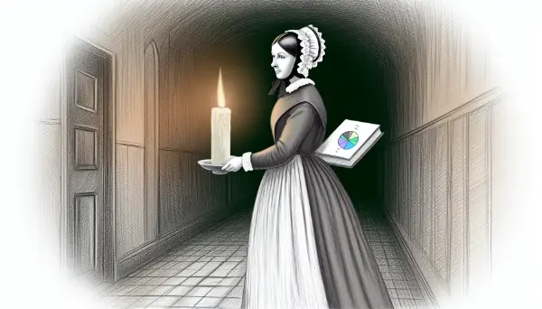

Rea,

Today, I want to share with you a story about how mathematics can be used to change the world. We often think of charts and graphs as just ways to present information, but they can be powerful tools for convincing people and driving change. This story is about a woman who used these tools in an unexpected and revolutionary way.

You've probably heard of Florence Nightingale. She's famous for being the founder of modern nursing, known as "The Lady with the Lamp" for her work caring for wounded soldiers during the Crimean War in the 1850s. But what many people don't know is that she was also a pioneering statistician!

When Nightingale returned to England after the war, she was haunted by the high number of soldiers who had died not from battle wounds, but from diseases in the hospitals. She was convinced that poor hygiene was the culprit, but she needed a way to prove it and convince others.

This is where her brilliant mind turned to mathematics and statistics. At that time, statistical reports were typically found in large, boring volumes called Blue Books, written only for government officials. Nightingale knew she needed to reach a wider audience to make real change.

So, she did something revolutionary. She took those dry statistics and turned them into visual diagrams, some of which she designed herself. These weren't just any charts - they were clear, compelling visual arguments that showed how improved sanitation could save lives.

One of her most famous diagrams was the "rose diagram" or "coxcomb," which clearly showed that more soldiers were dying from preventable diseases than from battle wounds. Each wedge in the diagram represented deaths from different causes, and the area of each wedge showed the number of deaths. The visual impact was striking and impossible to ignore.

Nightingale's innovative use of statistics and visual representation did more than just prove her point - it changed how people thought about public health. Her work led to major reforms in military hospitals and eventually in civilian hospitals too, saving countless lives. Nightingale took complex data and turned it into a compelling visual story that anyone could understand. She used math not just to describe the world, but to change it for the better.

So, Rea, next time you're working on a math problem or looking at a chart, remember that numbers and graphs aren't just abstract concepts - they can be tools to understand the world deeply and to convince others to make it better.

Love,
Abba

