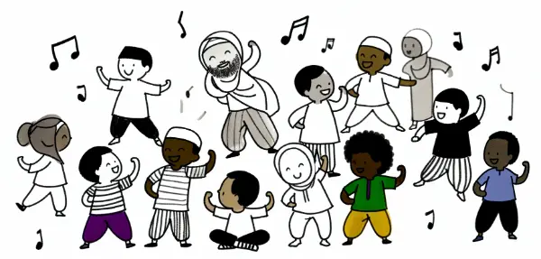

Rea,

Imagine this: It's early morning, and you turn on the radio. Suddenly, a cheerful voice fills the room, guiding you through a series of gentle exercises. As you start to move, stretching your arms and twisting your body, a remarkable thought strikes you - at this very moment, millions of people across the country are doing exactly the same thing. In living rooms, offices, schools, and factories, a vast, invisible community is moving in unison, connected by nothing more than radio waves and a shared commitment to start their day with energy and purpose.

This may sound like a scene from a science fiction novel, but in Japan, it's been a reality for nearly a century! Welcome to the world of Radio Taiso.

Let's travel back to 1928 when Japan launched the "National Health Exercise Program" to celebrate Emperor Hirohito's ascension. This program, now called "Radio Taiso," became a national phenomenon. Every morning at 6:30, radios across Japan would come alive, and millions would start their day with a 10-minute guided exercise routine.

Amazingly, Radio Taiso is still going strong today! A survey in the early 2000s found that 27 million people in Japan do these exercises more than twice a week. It's not just for home use either - students do it before class, construction workers before picking up tools, and office workers before starting their day.

Radio Taiso consists of simple, gentle exercises designed to wake up your body. Think arm circles, gentle twists, and easy stretches. It's not about breaking a sweat – it's about starting your day with movement and connecting with others.

Now, imagine if we had something like this in our society. What if, before boarding a plane, all passengers did quick stretches together in the boarding area? Picture businesspeople, families, and solo travelers all lined up, reaching for the sky or gently twisting. Do you think it might change the atmosphere on the plane?

This idea of collective movement isn't just about physical health – it's about creating connections, reducing stress, and starting our day with a positive, shared experience.

So, Rea, next time you're waiting somewhere, why not try a few simple stretches? You never know, you might start a mini Radio Taiso revolution of your own!

Love,
Abba
