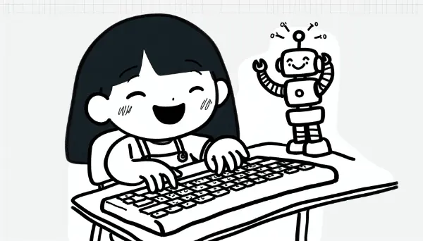

Rea

I'm excited you're learning about compilers through your project on Grace Hopper! Let me take you on a journey to understand how computers work and what compilers do.

Imagine a magical world called Bits-and-Bytes, inhabited by tiny creatures called Binarians. These Binarians only have two letters in their language: "Bip" (for on) and "Bop" (for off). You might think, "How can they communicate with just two words?" Well, it's similar to how we use only 26 letters in English to create thousands of words! The Binarians combine their "Bips" and "Bops" in different patterns to convey complex messages.

For example:
- "Bip Bop" might mean "Hello"
- "Bop Bip Bip" could mean "Goodbye"
- "Bip Bip Bop Bop" might mean "I'm hungry"

In the real world, computers are like Binarians. They only understand two signals: 0 and 1. This is called binary code. In the early days of computing, humans had to "speak" to computers using these 0s and 1s. Can you imagine how long it would take to write a simple sentence? It would be like trying to have a conversation using only hand claps and foot stomps!

For instance, to represent the letter 'A' in binary, you'd need to input "01000001". Now, imagine writing a whole paragraph this way!

This is where our hero, Grace Hopper, comes in. She created the first compiler, which was like a magical translator between human language and computer language.Hopper's compiler allowed people to write instructions in a language that was closer to English. The compiler would then translate these instructions into the 0s and 1s that computers understand. It was revolutionary!

Today, we have many "English-like" programming languages, such as Python or Javascript. Compilers (and their cousins, interpreters) translate these languages into machine code. It's like having a super-fast translator that can instantly convert your words into Binarian!

As an exciting development, modern Artificial Intelligence (AI) can now understand and process natural language - the way we normally speak and write. This field is called Natural Language Processing (NLP). It's why you can ask AI assistants questions in plain English and get sensible responses!

Isn't it amazing how far we've come from the days of speaking in 0s and 1s? Who knows, maybe one day we'll be able to program computers just by thinking!

Love, 
Abba