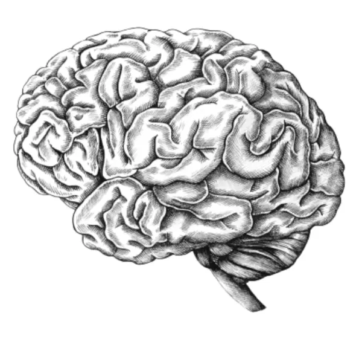

Rea,

It's cool to see you embracing flashcards in your studies! I'm so proud of how dedicated you are to learning. Let me share some cool facts about this study method you're using.

Did you know flashcards have been around for centuries? They were first used in the 19th century by English educator Favell Lee Mortimer. But their popularity really took off in the 1960s when technology allowed for mass production of study materials. Now, with digital apps, flashcards are more accessible than ever!

You might wonder, "Why do flashcards work so well?" The secret lies in something called Active Recall. When you look at a question on a flashcard and try to remember the answer, you're actively pulling that information from your memory. This process strengthens the neural pathways in your brain associated with that information, making it easier to recall later. It's like exercising a muscle – the more you use it, the stronger it gets!

But here's how you can supercharge your flashcard studying: use a technique called Spaced Repetition. This concept was developed by Hermann Ebbinghaus, a German psychologist, in the late 19th century. He discovered that we tend to forget information over time, but reviewing it at increasing intervals can help us remember it long-term.

One popular way to apply this is the Leitner System. Imagine you have five boxes. New flashcards start in Box 1. If you get a card right, it moves to the next box. If you get it wrong, it goes back to Box 1. You review Box 1 every day, Box 2 every other day, Box 3 every four days, and so on. This way, you spend more time on difficult cards and less on ones you know well.

Want to make your flashcards even more effective? Try adding drawings or diagrams. Our brains love visual information, and combining words with pictures can help you remember things better. 

Remember, the best flashcards are the ones you create yourself. When you put information into your own words or drawings, you're already starting the learning process!

I'm excited to see how you'll use these techniques, Rea. Learning how to learn is one of the most valuable skills you can develop. It'll serve you well not just for your upcoming quiz, but throughout your life. Remember, it's not just about the grade – it's about the joy of learning and growing. I'm always here if you want to practice!

Love,
Abba
