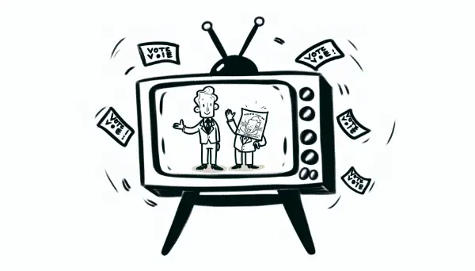

Rea,

I'm so proud of you for noticing the political ad on TV and asking questions about it. Our discussion this weekend was really important, and I'm glad we could dive into understanding media and information.

You asked a great question: **"Isn't what we see on TV fact-checked?"** The answer, surprisingly, is not always. People can indeed say things on TV that aren't entirely true, whether it's to get elected or to sell products. It's a bit like the schoolyard rumor mill, but with a much bigger audience! So, how do we navigate this world where not everything we hear or read is true? We become information detectives! Here are some key questions we can ask:

**1. Who is saying it?** 
In this case, the ad was made by the opposing candidate. This gives us important context.

**2. What would their motivation be?** 
They likely want us to think badly of the other candidate so we'll vote for them instead.

**3. What is the actual news they're basing their claim on?** 
This is where it gets tricky. The ad claimed the candidate was "opposed to protecting women's sports." But when we dug deeper, we found out it was based on the candidate not voting for a bill that was actually about restricting transgender people's rights. The ad twisted this into a false claim about women's sports.

**4. Where could you verify the facts?** 
In this case, the Dallas Observer, a newspaper, had fact-checked the ads and explained why this one was false.

**5. Can we trust the source we're using to verify?** 
The Dallas Observer is an established newspaper with a good reputation, which makes it a reliable source.

Finding the truth is a lot like being a scientist, Rea. We observe, we ask questions, we look for evidence, and we draw conclusions. But we also stay open to new information that might change our understanding.

**Can people really say lies on TV to get elected or to sell us things?** Unfortunately, yes, they can. But now you have the tools to spot when something might not be quite right.

**So how can we protect ourselves from false information?** By staying curious, asking questions, and always looking for reliable sources to verify what we hear or see.

It's okay if this process seems challenging at first. The most important thing is to stay curious and keep asking questions. Don't be afraid to say, "I'm not sure about that" or "Let's look into this more." Keep that inquisitive mind of yours sharp – it's your best tool for navigating this sometimes confusing world!

Love,
Abba