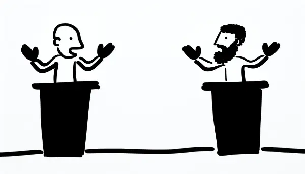

Rea,

I'm looking forward to watching the vice presidential debate with you tonight. It'll be interesting to see Tim Walz, the governor of Minnesota, and J.D. Vance, the senator from Ohio, go head-to-head. As we've seen from the campaign posters, they're running alongside Kamala Harris and Donald Trump respectively for the roles of president and vice president.

Did you know that the way we choose our president and vice president today is quite different from how it was originally set up in the U.S. Constitution? Back then, the candidate who received the most electoral votes would become president, and the runner-up would become vice president. Can you imagine if we still did that today? We might end up with a situation where Kamala Harris was president and Donald Trump was vice president, or vice versa!

This is exactly how it worked in the very first U.S. presidential election in 1788. George Washington became president, and John Adams, who came in second, became vice president. At first, this system seemed okay. But things got really complicated in the election of 1796 when Thomas Jefferson became president and his political rival, John Adams, ended up as his vice president. As you can imagine, they didn't exactly see eye-to-eye on many issues!

This awkward situation led to the creation of the 12th Amendment to the Constitution in 1804. This amendment changed the voting process so that the president and vice president would run together on the same ticket, just like we see with Harris-Walz and Trump-Vance today.

The 12th Amendment also changed the nature of American politics. Now, instead of the two top vote-getters having to work together despite their differences, we have a system where the president and vice president are almost always from the same party and share similar views.

This brings up a question: Was the old system better in some ways? It certainly forced people with different viewpoints to work together at the highest levels of government. On the other hand, it could lead to a lot of conflict and inefficiency if the president and vice president were constantly at odds.

What do you think, Rea? Do you think there might be some advantages to a system that forces people with different views to cooperate? Or do you think it's better to have a president and vice president who are on the same page?

Love,
Abba
