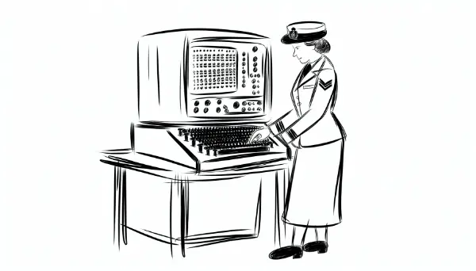

Rea,

I'm excited about your wax museum show today! I can't wait to see you bring Grace Hopper to life. As I've watched you prepare, I've been thinking about how different this is from how I learned in school. It got me wondering about why this kind of learning works so well.

Turns out, learning through role-playing and experiential learning has been gaining popularity since the 20th century. Educators realized people learn best when they're actively engaged rather than just passively listening or reading.

There's science behind why this works. When you physically act as Grace Hopper, your brain processes the information differently than if you just read about her. It's called embodied cognition - our physical experiences shape our understanding.

By dressing up, speaking as Grace Hopper, and interacting with others, you're creating a rich, multi-sensory experience. Our brains form stronger memories when we engage multiple senses and emotions. You're more likely to remember Grace Hopper's story because you're experiencing it, not just memorizing facts.

One of the most powerful aspects of this learning is perspective-taking. You're not just learning facts about her life - you're trying to understand how she thought, what challenges she faced, and why she made certain decisions. This ability to see the world from someone else's point of view is a valuable skill that extends far beyond this project.

You could use this approach for other subjects too. Imagine "becoming" a historical figure for a history project, or a scientist for a science fair. You could even use it for math or literature - try to put yourself in the shoes of a mathematician solving a complex problem, or a character in a novel facing a difficult decision.

The key is to engage your imagination and truly understand the perspective of the person or character you're studying. Ask yourself: What would they be thinking? How would they feel? What pressures were they dealing with?

This kind of deep, experiential learning helps develop empathy and critical thinking skills. It encourages you to consider different viewpoints and understand the context behind events and decisions.

Love,
Abba
