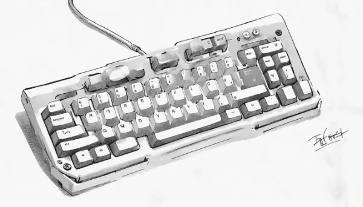

Rea,

I'm thinking about our first programming project together! Our goal is to create a program that takes two names and finds the letters they have in common. For example, if we give it "maite" and "rea," the program should tell us that the common letters are 'a' and 'e'.

A computer program, or algorithm, is like a recipe we give to a computer. The key is being incredibly precise with our instructions. Computers need exact steps to follow, with no gray areas. Imagine if I asked you to make a sandwich, but had to specify every tiny step, like "pick up the knife" and "unscrew the jar lid." That's how detailed we need to be with computers!

The programming language we'll use is mathematical and linear. By linear, I mean the computer follows instructions one by one, in order. It's like following a straight line from start to finish, no jumping around.

Here's a basic outline of our algorithm:
1. Get the first name and store it.
2. Get the second name and store it.
3. Create an empty list for common letters.
4. For each letter in the first name:
   - Check if it's in the second name. If it is, and it's not already in our common letters list, add it.
5. Display the list of common letters.

Now, here's a question: Do you see any potential problem or 'bug' in our program? What if someone entered "REA" and "rea" - would the computer see "R" and "r" as the same letter?

You're right if you thought there might be an issue! Computers treat uppercase and lowercase letters as completely different characters. Our program wouldn't recognize "R" and "r" as the same letter. To fix this, we need to add a step. Right after we get the names, but before comparing them, we should convert both to lowercase. This way, no matter how the names are entered, our program will always compare them correctly.

Remember, programming is all about problem-solving and creativity. Don't worry if we run into challenges - that's part of the process, and we'll figure it out together.

Love,
Abba

