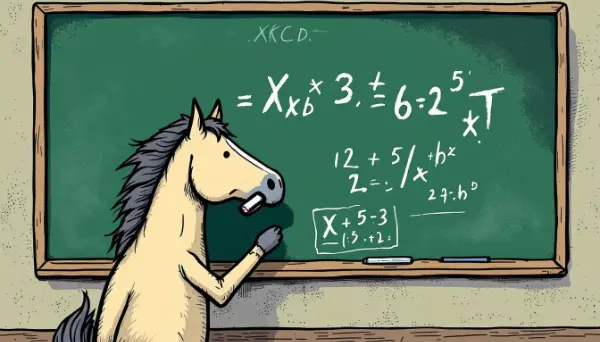

Rea,

I want to share a story with you about a horse named Clever Hans and how he changed the way we think about psychology. It's a tale that shows how sometimes the most extraordinary discoveries can come from unexpected places!

Back in the early 1900s, there was a man named Wilhelm Von Osten who believed animals could learn to read and count. After trying with dogs and even a bear (can you imagine?), he started working with a horse. This horse, named Clever Hans, seemed to be able to do incredible things!

Hans could answer questions by tapping his hoof, and he got them right 90% of the time! He could add, subtract, multiply, divide, and even tell the time and date. People thought he could read and understand German too. It was so amazing that crowds of people came to see him, and even scientists got interested.

At first, everyone thought Hans was genuinely smart. He could answer questions from anyone, even when Von Osten wasn't around. But then a psychologist named Oskar Pfungst decided to investigate further.

Pfungst noticed something odd: Hans couldn't answer questions if he was wearing blinders or if he was behind a screen. He also couldn't answer if the person asking didn't know the answer themselves. Can you guess what was really happening?

It turned out that Clever Hans wasn't actually doing math or reading. Instead, he had learned to pick up on tiny, unconscious signals that people were giving off. When someone asked a question, Hans would start tapping his hoof. He'd keep tapping until he saw the person make a tiny movement - like tilting their head - which happened when he reached the right answer. Then he'd stop tapping.

Hans was incredibly observant, noticing things that most humans wouldn't even realize they were doing. He wasn't solving math problems, but he was doing something just as impressive - reading human body language with amazing accuracy!

This discovery taught us a lot about how our expectations can influence others, even without us realizing it. It makes me wonder: what amazing things might you be capable of that we haven't even imagined yet?

The story of Clever Hans reminds us that sometimes the most interesting discoveries come when we look at things from a new angle. It also shows how important it is to be curious and to keep asking questions, even when we think we know the answer.

Love,
Abba