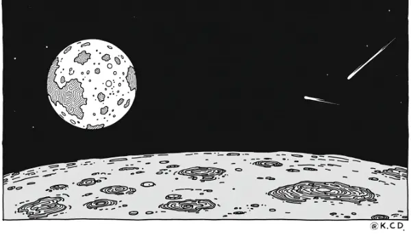

Rea,

Have you heard about the special visitor Earth is seeing recently? It's a comet called Tsuchinshan–ATLAS, and it's putting on quite a show in our night sky!

This comet, discovered just last year, is visible for the next few weeks. You can spot it in the south-west, and each night it will climb higher and higher in the sky until around Halloween. After that, it will start to get dimmer as time goes on.

But what exactly is a comet? Well, comets are often described as "dirty snowballs" in space. They're made of ice, dust, and rock, and they orbit the Sun just like planets do, but in much larger, more elongated orbits. Tsuchinshan–ATLAS comes from a place called the Oort cloud, which is like a giant cosmic cloud surrounding our entire solar system.

Comets become visible to us when they get close to the Sun. As they approach, the Sun's heat causes the comet's ice to turn directly into gas. This gas, along with dust particles, forms a glowing cloud around the comet called a coma, and creates that long, beautiful tail we see stretching across the sky.

What makes this comet extra special is its history. Scientists think the last time it visited Earth was over 80,000 years ago! Can you imagine that? Neanderthals might have looked up and seen this very same comet streaking across the sky.

It's amazing to think about how long this comet has been traveling through space, and how rarely it comes close enough for us to see. The next time it visits, it will be tens of thousands of years in the future. It makes me wonder - what do you think life on Earth might look like 80,000 years from now, when Tsuchinshan–ATLAS makes its next appearance? 

Will humans have spread to other planets? Will we have developed new technologies beyond our current imagination? Or will Earth have changed in ways we can't even predict?

Let's try to spot this cosmic visitor together one of these nights. It's not often we get to see a piece of space history with our own eyes!

Love,
Abba