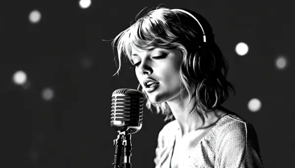

Rea,

Here's a question: Do you like a Taylor Swift song because it is great, or is it because it's by Taylor Swift? In other words how much does the "label" or the name attached to something affect our opinion of it.

There's a story that really highlights this idea, and it involves another famous artist you love: J.K. Rowling, the creator of the Harry Potter series. After writing so many magical books, Rowling wanted to try something different. But she faced a challenge - people expected everything she wrote to be as magical and amazing as Harry Potter. That's a lot of pressure!

So, Rowling decided to write a book under a different name, a pen name, so people wouldn't know it was her. She chose the name Robert Galbraith, which is about as different from J.K. Rowling as you can get! 

Rowling published a book called "The Cuckoo's Calling" as Robert Galbraith. At first, not many people bought it. It was ranked 4,709th on Amazon's bestseller list - not very high at all! But then something interesting happened. Someone used a computer to analyze the writing style and figured out that Robert Galbraith was actually J.K. Rowling.

Once people found out that J.K. Rowling had written the book, everything changed. The sales of "The Cuckoo's Calling" increased by over 150,000%! It shot up to number 3 on Amazon's bestseller list. The book hadn't changed at all - the only thing that changed was that people now knew who had really written it.

This story makes me wonder about how we judge things. Next time you listen to a Taylor Swift song, try to imagine what you would think if it was sung by someone you didn't know or didn't think much about. Would you still like it as much? How much of how you feel about the song is because of the music itself, and how much is because of who sang it?

It's an interesting exercise to think about how much the "cover" - the name or reputation attached to something - affects how we see its value. What do you think? Does knowing who created something change how you feel about it?

Love,
Abba

P.S. Maybe we could do a fun experiment sometime - listen to some songs without knowing who the artists are and see if we like them differently!