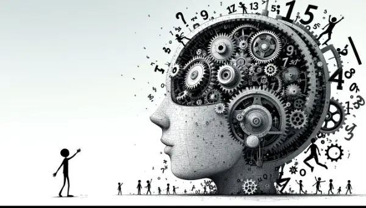

Rea,

Let's talk about something near and dear to your heart - pulleys. You've built some amazing ones, and as you've seen, they're great tools for transporting goods. The cable or twine you use allows you to pull the gondola from one location to another. Pulleys are fantastic mechanisms for moving things through the air - perfect for places where wheels just don't cut it. As humans, we're excellent tool builders, always finding ways to make our work easier and more efficient.

But did you know that we don't just build tools for the physical world? We also create tools for thinking and reasoning. Just like we use physical tools to build and move things far beyond our strength, we can use "tools for thought" to do things well beyond our brain's natural ability. In fact, you're already using some of these tools today without even realizing it!

Let's take the example of remembering things to do. Our untrained memory is pretty short - we easily forget things. When the first telephones were being set up, the phone company hired a researcher to figure out how long to make phone numbers. His research revealed that most people can remember about 7 digits, which is why phone numbers are usually around 7 digits long.

So what do we do when we have to remember more than that, or when we need to remember complex things like our homework? We use a tool like a checklist. With a checklist, we only need to remember one thing - to check the list! It's like a pulley cart for our brain, allowing us to keep thoughts and ideas together as we move from school to home and back.

Once you start seeing these things as tools for thought, you can begin tinkering with them and improving them, just like you work on better versions of pulleys. You can modify them to work better for you by trying different experiments. For example, you might find that color-coding or illustrating your checklist helps you prioritize tasks better.

As you go about your day today, I'd love for you to think about various tools for thought you use. What else do you use besides checklists? Maybe you have a special way of organizing your notes for class, or a method for memorizing vocabulary words.

I can't wait to hear about the tools for thought you discover in your day. Who knows? Maybe you'll even invent a new one!

Love,
Abba