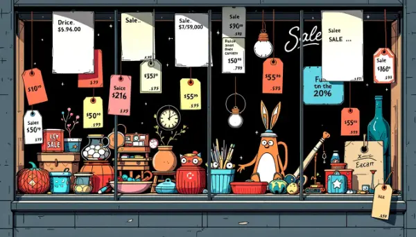

Rea,

Have you ever wondered why the prices of things aren't always the same for everyone? It's an interesting topic that I thought we could explore together.

When we go to a store, we usually see a price tag on an item and assume that's what everyone pays. But the world of pricing is actually much more complex and fascinating than that!

Let's take airplane tickets as an example. Have you noticed how the prices seem to change all the time? If you book a flight a year in advance, you might get a great deal because there are plenty of seats available. But if you wait until a week before the flight, when fewer seats are left, the price could skyrocket!

Here's where it gets even more interesting: sometimes, if you book a flight on the same day of travel, the price might actually go down. Why? Well, the airline realizes that an empty seat earns them no money at all, so they'd rather sell it for less than not sell it at all.

We see similar things happen in grocery stores. Have you ever noticed those bright stickers that cut the price of some items in half? That often happens when food is about to expire. The store would rather sell it at a discount than throw it away and make no money at all.

This kind of pricing strategy is called "dynamic pricing." It's when businesses change their prices based on different factors like demand, time, or even the weather!

Speaking of weather, imagine you had your own lemonade stand. Would you charge more on a hot, sunny day when lots of people are thirsty? Or would you keep your price the same even on a cold day when fewer people want lemonade? It's an interesting thing to think about, isn't it?

As we go about our day, I'd love for you to keep an eye out for examples of dynamic pricing. When you see these price differences, try to think about what might be going on behind the scenes. What factors might the seller be considering? Are they trying to sell more of something before it goes bad? Or are they raising prices because they know a lot of people want to buy it right now?

So, what do you think? If you were in charge of pricing things, how would you decide what to charge? I'd love to hear your ideas!

Love,
Abba