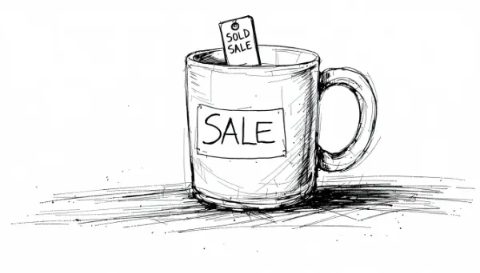

Rea,

Which one do you think is cheaper: a $30 mug or a $100 mug on sale for $30?

If you said they're both the same price, you're absolutely right! But here's the funny thing - even though they cost the same, the $100 mug on sale often feels like a better deal. Isn't that strange?

This happens because of something called "anchoring bias" in our brains. It works like this: When we first see a price, our brain doesn't really know if it's a good deal or not. Is $30 a fair price for a mug? Maybe. But if we're told the mug was originally $100 and is now $30, our brain gets excited. It "anchors" to that original $100 price, making the $30 feel like an amazing bargain.

Let's try another example. Imagine two mugs, both priced at $30. One is on sale from $60, and the other from $100. Even though they're the same price now, the one marked down from $100 feels like a better deal, doesn't it?

Now, here's where it gets interesting. Stores and manufacturers know about this anchoring effect too. They might price something high, knowing they'll put it on sale later, just so you'll feel like you're getting a great deal. Remember that Gap store we always walk by? Have you noticed how it seems to be running a big sale almost all the time? That's the anchoring effect at work!

So how can we outsmart this trick our brain plays on us? One way is to try to ignore the original price and ask ourselves, "Is this item really worth the current price to me?" For that $30 mug, instead of getting excited about how much it's marked down, we should ask if we really think it's worth $30.

I have a challenge for you: As we go about our lives, keep an eye out for sales and discounts. When you see one, ask yourself if it's really a good deal. Is the item worth the sale price, regardless of what it used to cost? It's like being a detective, trying to figure out the true value of things!

Remember, just because something is on sale doesn't always mean it's a great deal. By thinking critically about prices, you can become a super-smart shopper!

Let me know what "deals" you spot and what you think about them. I'm especially curious if you notice anything interesting the next time we pass by that Gap store. Do their sale signs look different to you now?

Love,
Abba

