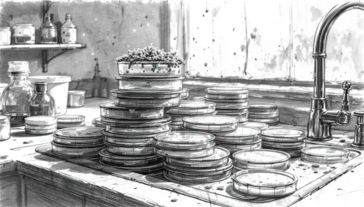

Rea,

Did you know a stack of dirty dishes led to the discovery of a powerful medicine that has saved millions of lives?

It's true! This incredible story is about penicillin, the first antibiotic ever discovered. But before we dive into the story, let me explain what an antibiotic is. An antibiotic is a special type of medicine that fights tiny organisms called bacteria, which can sometimes make us sick. Antibiotics help our bodies defeat these harmful bacteria and cure infections.

Remember when you had to take that liquid medicine called amoxicillin when you were sick? I know it tasted pretty awful, but it was actually an antibiotic helping your body fight off the infection. Amoxicillin is a type of penicillin, and its discovery has a fascinating history.

Back in 1928, a British scientist named Alexander Fleming was working in his laboratory, studying different types of bacteria. He was about to go on vacation, and in his rush to leave, he did something many of us have done before – he left a stack of dirty dishes behind. But these weren't ordinary dishes. They were special petri dishes scientists use to grow bacteria for their experiments.

When Fleming returned from his vacation, he noticed something strange in one of the dishes he'd left out. There was a spot where the bacteria weren't growing. Instead, there was a fuzzy green mold. Most people might have just cleaned up the dish and started over, but Fleming paid close attention to this unusual sight

He examined the dish more closely and realized that the mold was preventing the bacteria from growing around it. This mold, which we now know as Penicillium, was producing a substance that killed the bacteria!

Fleming's keen observation led him to discover penicillin, the first antibiotic. This discovery revolutionized medicine and has since saved millions of lives by helping fight bacterial infections that were once deadly. Today, we have many different types of antibiotics, like the amoxicillin you've taken, all thanks to Fleming's discovery.

The real lesson here isn't about leaving dishes dirty – it's about the power of paying attention. Fleming noticed something unusual because he was observant and curious.

So, while it's important to clean up after ourselves, it's equally important to keep our eyes open and pay attention to the world around us. You never know what amazing things you might discover if you look closely enough.

Love,
Abba