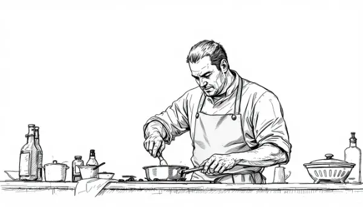

Rea,

Imagine you had a restaurant that won a very coveted prize - would you ever think about giving it back? It sounds crazy, right? Well, let me tell you about a chef who did exactly that.

Chef Sébastien Bras runs a restaurant called Le Suquet à Laguiole in France. This isn't just any restaurant - it's one that had earned three Michelin stars. Now, you might be wondering, "What's a Michelin star?" 

Well, Michelin stars are like gold medals for restaurants. They're super hard to get, and having even one star can make a restaurant famous. Three stars? That's like being the Olympic champion of the food world!

Sébastien's restaurant, which his father Michel started, had these three precious stars. Most chefs would do anything to keep them. But Sébastien did something that shocked everyone - he asked Michelin to take their stars back!

Why would he do such a thing? Sébastien realized that the pressure of keeping those stars was making him unhappy. He said, "Food should be about love — not about competition." He wanted to cook and welcome people to his restaurant without constantly worrying about maintaining a perfect rating.

It's like if you always got A+ on your report card, but you were so stressed about keeping those perfect grades that you stopped enjoying learning. Sébastien decided that his love for cooking and making people happy was more important than having the best "grade" in the restaurant world.

This story teaches us something important. While it's great to work hard and achieve recognition, it shouldn't be the only reason we do things. 

So, whether you're cooking a meal, doing your homework, or working on any project, try to focus on the journey and what you're learning, not just the end result or grade. I know it's not easy - I continue to struggle with this myself and am always learning how to do it better. It's a lifelong process, but if you get better at it, then the journeys, hard as they may be, become more enjoyable and rewarding

Love,
Abba