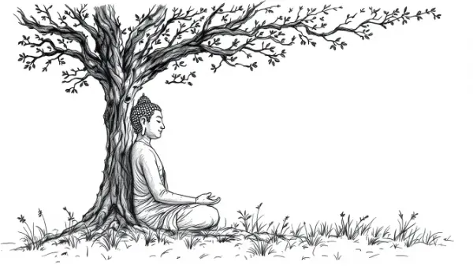

Rea,

Imagine if you had every possible pleasure in life - would you give it all up to understand the cause of pain? That's exactly what a young prince in India named Siddhartha did, and he came to be known as the Buddha. This is his story and how it led to the founding of Buddhism.

About 2,500 years ago, in northern India, a prince named Siddhartha Gautama was born to a king and queen. At his birth, a fortune teller predicted that Siddhartha would grow up to be either a great king or a great sage. A sage is a person known for their wisdom and insight - like a really smart teacher who understands deep truths about life.

Siddhartha's father, wanting his son to become a great king, decided to shield him from all pain and suffering. He kept Siddhartha within the palace walls, surrounded by luxury and protected from the hardships of the outside world. But Siddhartha was curious about what lay beyond.

One day, he managed to get out of the palace and saw the realities of old age, sickness, and death. These sights shocked Siddhartha. For the first time, he realized that everyone, no matter how rich or powerful, would eventually face these challenges.

This realization troubled Siddhartha deeply. He couldn't understand why life was like this, with everyone destined to suffer. He decided to dedicate his life to figuring out why we suffer and how to overcome it. One night, Siddhartha snuck out of the palace, leaving behind all his possessions. He spent the next six years wandering the forests, meditating and begging for food.

Finally, Siddhartha had a profound realization. He understood that his way of looking at the world had been an illusion. He "woke up" from the dream he had been living in and became known as the Buddha - which means "the awakened one."

The important thing to understand is that Buddha's awakening didn't mean he escaped from the pains of life. Buddha eventually got old, fell ill, and died like everyone else. What he realized was that while pain in life is inevitable, suffering comes from our perspective on that pain. This is why he's sometimes called the first psychologist - he was curious about how our minds cause us to suffer. He was so dedicated to understanding this that he gave up everything in his comfortable life to pursue this knowledge.

Rea, is there a question that you find irresistible? Something you're so curious about that you could imagine following it into the deep forests, away from the comforts of life? I think that great questions give life its passion and flavor.

Love, Abba
