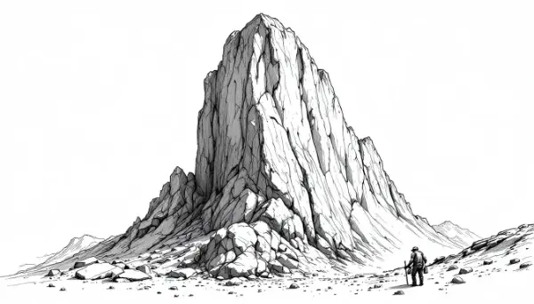

Rea,

Do you think the key to happiness is our circumstances or our perspective? In other words, are we happy because of how things are going or what we think about the things we're going through? Today I want to share with you a fascinating Chinese story about a stonecutter that I first heard about 25 years ago when I was learning meditation.

Once upon a time, there was a stonecutter who felt deeply dissatisfied with his life. He constantly wished he could be in others' shoes, believing their circumstances would bring him happiness and power.

One day, he saw a wealthy merchant's luxurious life and wished to be like him. Amazingly, his wish came true! But soon, he saw a high official and wished for that power instead. Again, his wish was granted.

As a high official carried in an embroidered sedan chair, he felt uncomfortable on a sweltering day. Looking up, he saw the sun shining proudly in the sky, unaffected by earthly matters. "How powerful the sun is!" he thought, and in an instant, he became the sun.

He shone fiercely, scorching fields and making farmers curse his intense heat. He reveled in his power to affect the entire world. But suddenly, a huge black cloud moved between him and the earth, blocking his light. Frustrated, he wished to be the cloud.

As a cloud, he flooded fields and villages, pouring down rain at will. People shouted in anger and fear, but he felt mighty. However, his triumph was short-lived. A great force began pushing him across the sky - the wind. Impressed by its strength, he became the wind.

He howled with glee, uprooting trees and blowing tiles off roofs. Everyone cowered before his gusts. But then he encountered an immovable object - a huge, towering stone. No matter how hard he blew, it wouldn't budge. Awestruck, he wished to become the stone.

As the stone, he felt invincible. But even this form wasn't immune to change. He heard the sound of a hammer and chisel and felt himself being shaped. Looking down, he saw a stonecutter steadily working away.

The cycle had come full circle, each form seemingly more powerful than the last, yet each with its own limitations.

Rea, I'd love to hear what you think about this tale. If you could transform into anything in the world, what would you choose and why? Remember, sometimes the most extraordinary powers are found in the most unexpected places!

Love,
Abba