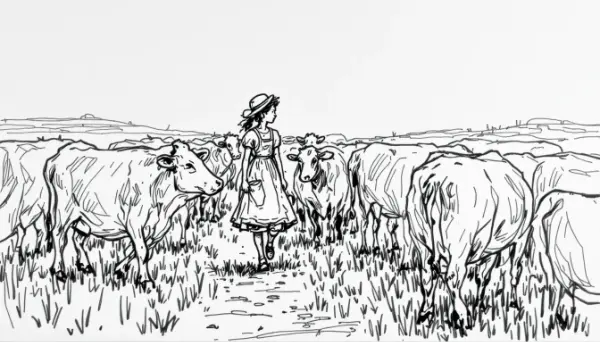

Rea,

Would you be willing to get a little sick now to avoid getting very sick later? That's the idea behind vaccines. Today, we use vaccines for things like the flu or COVID-19, and they contain a tiny bit of the dangerous virus to teach our bodies how to fight it. It's amazing how something we now see as so important was once considered quite strange!

Let's take a little journey back in time to the late 1700s. Back then, a scary disease called smallpox was terrorizing the world. Smallpox was highly contagious and caused fever and a skin rash with fluid-filled blisters. It was so dangerous that it killed about one in every three people who got sick, and those who survived were often left with severe scars. This disease didn't care if you were rich or poor, young or old - it affected everyone.

In rural England, there was a country doctor named Edward Jenner who was very curious. While working with his patients, he noticed something interesting about milkmaids - the young women who milked cows. These milkmaids often got a mild disease called cowpox from the cows, but they rarely seemed to get smallpox. This observation gave Jenner an idea for a bold experiment.

In 1796, Jenner did something that might sound a bit scary. He took some material from a cowpox sore on a milkmaid's hand and put it into the arm of an 8-year-old boy named James Phipps. James got a mild case of cowpox but quickly got better. Later, when Jenner exposed James to smallpox, the boy didn't get sick at all! Jenner had found a way to protect people from a deadly disease by giving them a milder, related illness first.

At first, many people thought Jenner's idea was crazy. Can you imagine how strange it must have sounded to intentionally give someone an animal disease to prevent a human one? But Jenner was very careful in his work. He wrote down everything he did and saw, and shared his findings with other scientists. Slowly, as more evidence showed that this method worked, people began to accept it. Jenner called his new technique "vaccination," from the Latin word "vacca," which means cow, because it all started with cowpox.

Isn't it amazing, Rea, how something we now take for granted - getting vaccinated to prevent diseases - once seemed so odd and unbelievable? This story shows us that great discoveries often challenge what we believe and can seem strange at first.

Can you think of any ideas today that seem weird but might become normal in the future? 

Love,
Abba