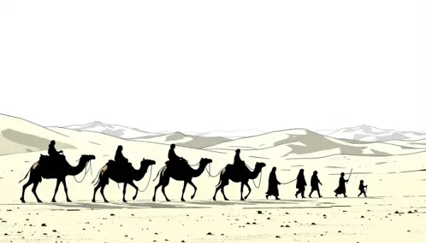

Rea,

Would you share a message even if it meant making people around you very angry? Would you stick with it for the rest of your life without wavering? This is the story of Muhammad and how God's message through him changed the world.

About 1,400 years ago, in a city called Mecca (in modern-day Saudi Arabia), a boy named Muhammad was born. Mecca was a challenging place to live back then. Rich merchants controlled everything, while many people lived in poverty. Muhammad often retreated to a cave called Hira to think and pray. He was troubled by the unfairness and cruelty he saw around him, and by the way people worshipped many different idols.

One night, when Muhammad was 40 years old, something interesting happened in that cave. An angel named Gabriel appeared to him with a message from God (whom Muslims call Allah). Muhammad was filled with awe at this presence - wouldn't you be if an angel appeared to you? But this was just the first of many messages he would receive over the next 23 years.

These messages became the Quran, the holy book of Islam. The word "Islam" means "submission to God" and "peace." Through these teachings, enormous changes came to society. The messages taught that all people were equal before God, regardless of their wealth or status. They established women's rights, including the right to own property and have a say in their marriage. The teachings emphasized caring for orphans and the poor, and resolving conflicts through dialogue rather than violence.

At first, only a few people believed in these messages. Some powerful people in Mecca were angry because these teachings threatened their way of life and their control over others. They made life so difficult for Muhammad and his followers that they had to leave Mecca and move to a city called Medina. This journey, known as the Hijra, marks the beginning of the Islamic calendar.

Under Muhammad's leadership, Medina became a community where Jews, Christians, and Muslims lived together peacefully. Following divine guidance, he established rules that protected everyone's rights and encouraged fair resolution of disagreements. These ideas were revolutionary for their time.

Think about this: When Muhammad received God's message, he devoted his life to sharing these teachings, even though it wasn't easy. What things do you see in the world today that you think need to change? 

Love,
Abba