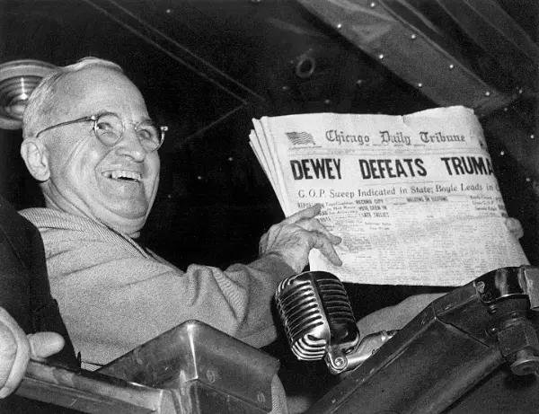

Rea,

Have you ever been so sure about something, only to find out you were completely wrong? Today, I want to share a story about one of the biggest mistakes in American election history. It's a tale that reminds us why we should never assume we know the outcome of something important until it's truly over.

Today is Election Day in our country, a day that could shape the next four years and beyond. The polls say both candidates are tied, and no one knows for sure who will win. But even when the polls seem clear, they're not always right. Let me tell you about the incredible election of 1948.

Back then, Harry Truman was the President of the United States, running for re-election against Thomas Dewey, the governor of New York. Almost everyone thought Dewey would win easily. The polls all said so, and most newspapers and radio shows agreed.

On election night, the Chicago Daily Tribune was so confident in Dewey's victory that they printed their early edition with a big, bold headline: "DEWEY DEFEATS TRUMAN". But as the night went on, something unexpected happened. Truman won the election! The newspaper headline was completely wrong.

The next day, someone handed President Truman a copy of the newspaper with that mistaken headline. Truman, with a big smile on his face, held up the newspaper for everyone to see. This moment became one of the most famous photographs in American political history - the winning candidate holding a newspaper that declared his defeat!

This story teaches us some important lessons. You might think this mistake would ruin the newspaper, but the Chicago Tribune continues to be a leading newspaper today. This shows us that even big mistakes can be overcome. Also, having a sense of humor helps in difficult situations. Truman could have been angry about the mistake, but instead, he turned it into a moment of joy and laughter. His ability to find humor in the situation made the moment even more memorable.

Rea, as you watch the election results come in tonight, remember this story. It reminds us that predictions can be wrong, and that we should wait for all the information before jumping to conclusions. But it also shows us that no matter how the election goes, things will be okay. Our country has faced uncertain elections before and has always moved forward.

Love,
Abba