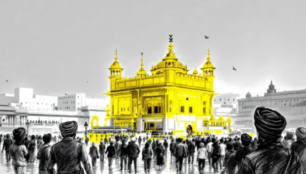

Rea,

You know when you've seen a man wearing a turban and I told you they might be a Sikh? Today, I want to tell you the story of the birth of Sikhism and its founder, Guru Nanak.

About 550 years ago, in a small village in what is now Pakistan, a boy named Nanak was born. He grew up in a time when India was divided by different religions, castes, and social classes. Nanak saw how unfair this was and wanted to change things.

When Nanak was about 30, something extraordinary happened. He disappeared for three days, and when he returned, he declared, "There is no Hindu, there is no Muslim." This was the beginning of a new faith: Sikhism. Nanak taught that everyone is equal in God's eyes, regardless of their background or beliefs. He traveled far and wide, sharing his message of love, equality, and devotion to one God. His followers became known as Sikhs, which means "learners" or "disciples."

One of the most beautiful Sikh traditions is the langar, a free community kitchen where everyone sits together on the floor to share a meal. This practice symbolizes equality and service to others. The Golden Temple in Amritsar, India, has the largest free kitchen in the world, serving free meals to over 100,000 people every day!

Sikhs have some unique customs that make them stand out. Many Sikh men (and some women) wear turbans and don't cut their hair. This is part of their religious practice, showing respect for God's creation. However, not all Sikhs follow this tradition, and that's okay too.

Sikhs are also known for carrying five special items, called the Five Ks: uncut hair (Kesh), a wooden comb (Kangha), a steel bracelet (Kara), special underwear (Kachera), and a small sword (Kirpan). These items remind Sikhs of their faith and commitments. 

Nanak's teachings were so powerful that they continued to spread even after his death. Today, Sikhism is the fifth-largest religion in the world, with about 30 million followers. Sikhs are known for their generosity, bravery, and commitment to serving others.

Love,
Abba